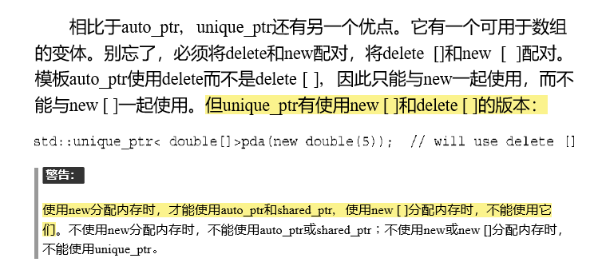

## 1.存在的意义
在使用一般指针编程的时候会出现的几种错误：
1. 使用`new`申请堆空间忘记`delete`
2. `delete`之前发生异常，不正常结束，跳过`delete`
3. 当多线程使用指向同一个堆地址的指针，不知道本线程退出时是否应该`delete`，以及是使用时否已经`delete`

## 2.通用的实现方法
使用一个类，类的成员变量中有一根指针`ptr`，类重载指针的操作：解引用`*()`，调用`->`，在析构的时候`delete ptr`。

存在的问题：多个智能指针指向同一个堆地址，第一个智能指针析构后，后面的指针析构时就会发生重复`delete`。

解决方案：

> 1. 定义赋值运算符，使之执行深复制。这样两个指针将指向不同的对象，其中的一个对象是另一个对象的副本。（赋值后指向的地址不再相同，失去指针意义）
> 2. 建立所有权（ownership）概念，对于特定的对象，只能有一个智能指针可拥有它，这样只有拥有对象的智能指针的构造函数会删除该对象。然后，让赋值操作转让所有权。这就是用于`auto_ptr`和`unique_ptr`的策略，但`unique_ptr`的策略更严格。
> 3. 创建智能更高的指针，跟踪引用特定对象的智能指针数。这称为引用计数（reference counting）。例如，赋值时，计数将加1，而指针过期时，计数将减1。仅当最后一个指针过期时，才调用delete。这是`shared_ptr`采用的策略。

## 3.auto_ptr & unique_ptr 

`unique_ptr `可以传入`new[] `返回的指针，在定义的时候需要加上`[]`（只有`unique_ptr`可以使用`new[] `）(问题：`shared_ptr `vs2017中也可以使用`new []`)。如： 

```c++
unique_ptr<double[]> pad(new double[5]);
pad[3] = 3.9; //像数组一样访问
```



`auto_ptr`是`c++98`标准中的（`c++11`弃用），`unique_ptr`是`c++11`标准中的。 

`auto_ptr `能够赋值给`auto_ptr`, 而`unique_ptr`**不**能赋值给`unique_ptr`（但是**右值**`unique_ptr`能够赋值给`unique_ptr`）。 

```c++
#include <iostream>
#include <memory>
#include <string>
using namespace std;

unique_ptr<string> demo1(string s) {
	return unique_ptr<string> (new string(s));
}

auto_ptr<string> demo2(string s) {
	return auto_ptr<string>(new string(s));
}

int main() {
	string *s1 = new string("some words");
	unique_ptr<string> up1(s1);
	//unique_ptr<string> up2 = up1;  编译不通过
	unique_ptr<string> up2 = unique_ptr<string>(new string("some words"));
   // 允许，临时变量为右值
   unique_ptr<string> up3 = demo1("some words");
   // 允许，值返回的临时变量为右值
   
	string *s2 = new string("some words");
	auto_ptr<string> ap1(s2);
	auto_ptr<string> ap2 = ap1;
   // 允许，但ap1已经失去s2的所有权
	auto_ptr<string> ap3 = auto_ptr<string>(new string("some words"));
	auto_ptr<string> ap4 = demo2("some words");

	cout << *ap1 << endl; // 运行时出错
	system("pause");
}
```

## 4. shared_ptr

`shared_ptr`中有两个指针：

1. 构造时传入的指针
2. 指向控制块的指针

在`shared_ptr`拷贝构造或者赋值的时候（如`shared_ptr<int>a = b`），`a`的控制块指针指向`b`的控制块，并将控制块中的引用次数+1（原子操作）。

由实现可以看出，共享多个`shared_ptr`，一定要是： 

```c++
int *num = new int(6);
shared_ptr<int> old_ptr(num);
//成功共享
shared_ptr<int> new_ptr = old_ptr;
shared_ptr<int> new_ptr(old_ptr);

//错误共享
shared_ptr<int> new_ptr<num>
```

line8中的构造方式，`new_ptr`和`old_ptr`的控制块并不是同一个，因此会发生多次析构的问题。

### shared_ptr的循环引用问题 

```c++
#include <iostream>
#include <memory>
#include <string>
using namespace std;

unique_ptr<string> demo1(string s) {
	return unique_ptr<string> (new string(s));
}

auto_ptr<string> demo2(string s) {
	return auto_ptr<string>(new string(s));
}

struct structA;
struct structB;

struct structA
{
	shared_ptr<structB> Aptr;
	~structA() { cout << "deconstruct  A" << endl; }
};

struct structB
{
	shared_ptr<structA> Bptr;
	~structB() { cout << "deconstruct  B" << endl; }
};

int main() {
	{
		shared_ptr<structA> ap(new structA);
		{
			shared_ptr<structB> bp(new structB);
			cout << ap.use_count() << endl;
			cout << bp.use_count() << endl;
			cout << ap->Aptr.use_count() << endl;
			cout << bp->Bptr.use_count() << endl;

			ap->Aptr = bp;
			bp->Bptr = ap;
			cout << endl;


			cout << ap.use_count() << endl;
			cout << bp.use_count() << endl;
			cout << ap->Aptr.use_count() << endl;
			cout << bp->Bptr.use_count() << endl;
		}
		cout << endl;
		cout << ap.use_count() << endl;
		cout << ap->Aptr.use_count() << endl;
	}

	system("pause");
}
/*
输出：
1
1
0
0

2
2
2
2

2
1
*/
```

 

1. 可以看到，在39~40的操作之后，4个智能指针的引用计数器都为2。
2. 在48行`bp`析构的时候，因为`Aptr`还在指向`structB`，只有`bp`被析构，`bp`指向的`structB`并没有从堆中析构。
3. 因为`structB`没有从堆中析构，`Bptr`仍然指向`structA`，所以`ap`析构的时候，`ap`指向的`structA`也不会从堆中析构。
4. 最后情况是堆中既有`structA`，也有`structB`，他们的指针的引用计数都为1，内存泄露发生。

循环引用的避免：

1. 将其中一个`shared_ptr`改为`weak_ptr`（`weak_ptr`只是一种编译时的循环引用解决方案，如果运行时发生，依然会造成内存泄露）。
2. 设计时避免循环引用

## 5. weak_ptr 

使用较少，暂不探索

## 参考

- *https://blog.csdn.net/xuanyuanlei1020/article/details/81559030*
- *C++ primer plus 第六版 16.2 智能指针模板类*